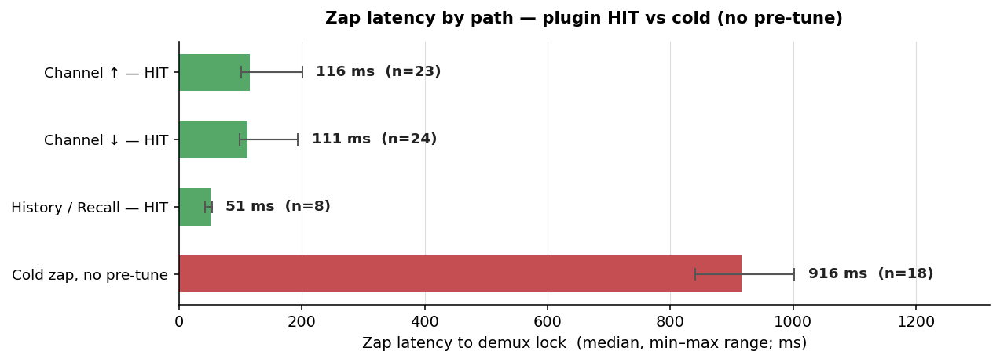
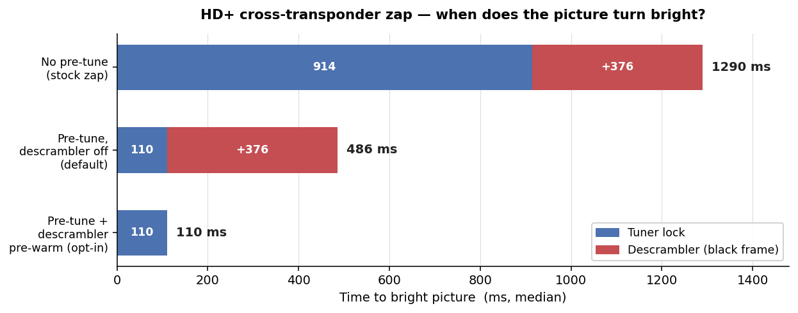

# FBC-ChannelSpeedChange

An OpenATV / Enigma2 plugin that accelerates channel zapping on receivers
with FBC (Full Band Capture) tuners. Designed and field-tested on the
**GigaBlue UHD Quad 4K Pro**. Measured medians on this hardware:
**Channel ↑/↓ 111–116 ms**, **History/Recall 51 ms** — down from
~900 ms for the same cross-transponder zaps without the plugin. PiP
and Recording always retain priority on the FBC demodulator pool.

## Upgrading from v0.3.7?

Pay-TV channels (HD+, Sky, …) now show a brief black frame
(~400 ms) on HIT zaps. **This is intentional, not a bug** — the
descrambler is no longer pre-engaged during pre-tune, so the
plugin stays out of the way of cardsharing setups, single-decode
CAMs and CI+ modules. Free-to-air channels are unaffected.

To restore v0.3.7-style fast pay-TV zaps — only safe with a
multi-decode capable card AND no cardsharing concern — enable
one or more of the **Activate descrambler in … pay-TV pre-tune**
toggles in the plugin settings. Each enabled toggle keeps one
extra descrambler session running in addition to the live one;
that extra session stays active for as long as the slot is armed
— whether the user is actively zapping or just sitting on a
channel — so card load scales linearly with how many toggles are
on. Pick the direction that matches your zap pattern: **NEXT**
for Channel ↑, **PREVIOUS** for Channel ↓, **LAST** for the
last-channel button. Full trade-off in the **Pay-TV channels**
section below.

## Why another zap accelerator?

The two existing options on OpenATV both have gaps for the
GigaBlue UHD Quad 4K Pro use case:

**Built-in FCC (`eFCCServiceManager`)** — kernel-level fast
channel change infrastructure. Theoretically the fastest possible
path, but on OpenATV 7.6.0 the singleton is never constructed
(`getInstance()` returns `None`) and the user-facing config
option is not exposed. This build offers no way to bootstrap it
from Python. On builds that DO expose it, FCC only accelerates
the next channel and only within the same band.

**SpecialJump (`openatv/SpecialJump`)** — a Swiss-army-knife
plugin whose primary purpose is ad-skipping in recorded videos
(binary-search jump algorithm). Its "Fast Zap Mode" is one
feature among many. The zap part pre-tunes the **next** channel
on a second tuner — no previous, no history — and does not
distinguish FBC from non-FBC tuners.

This plugin is the opposite trade-off: a **focused zap
accelerator** that does nothing else. It pre-tunes all three
zap directions, refuses to allocate on non-FBC tuners, gives
PiP / Recording absolute priority, and instruments itself
heavily so you can measure what you actually get on your own
hardware.

### Feature list

- Pre-tune NEXT channel in the bouquet
- Pre-tune PREVIOUS channel in the bouquet
- Pre-tune LAST-WATCHED channel (History / Recall zap)
- Per-direction yes/no toggle in the settings UI
- Pay-TV-safe by default: pre-tunes scrambled channels at the
  transponder level only; the CA descrambler stays disengaged
  so cardsharing setups, single-decode CAMs and CI+ modules see
  no extra load. Per-direction opt-in toggles let users with a
  capable card reclaim the full HD+ HIT speedup. See "Pay-TV
  channels" below.
- FBC-only allocation — refuses to touch USB or non-FBC slots
- Auto-release of the pre-tune pool when a recording enters
  STATE_PREPARED (before the recorder needs the demod)
- Auto-release of the pre-tune pool when PiP becomes visible
- Two-tier safety opt-in: `allow_pretune` master switch plus
  `use_real_pretune` for the prepare()+start() path
- Crash watchdog: self-disable after three consecutive failures
  with a one-shot user notification
- Startup sanity check: verifies the required enigma2 interfaces
  (`InfoBar.zapUp`/`zapDown`/`servicelist`,
  `NavigationInstance.recordService`/`playService`) before hooking
  anything; refuses to start with a clear notification on an
  incompatible build instead of failing at the first zap, and logs
  a degraded-mode warning when an optional interface is missing
- Preserves `servicelist.history` and the channel-list cursor
  on every HIT (so the standard history navigation, the
  history selector dialog, and the channel-list cursor all
  behave like without the plugin)
- Optional on-screen latency overlay (colour-coded, off by
  default)
- Per-zap timing CSV (`/tmp/fbc_csc_timing.csv`) with
  `tools/zap_stats.py` summariser for objective A/B testing
- tmpfs reclaim every 2 seconds via
  `fallocate(PUNCH_HOLE | KEEP_SIZE)` so the throwaway pre-tune
  `.ts` files do not balloon RAM
- Dependency-injected enigma2 APIs so the codebase can be
  unit-tested off-box (56 tests at the time of writing)

## Measured performance

Field measurement on the GigaBlue UHD Quad 4K Pro running
OpenATV 7.6.0 (`gbquad4kpro`, Astra 19.2°E + 28.2°E, mixed
FTA/HD+ bouquet, v0.4.0). Medians over ~30 hand-driven zaps per
configuration; the HIT rows use the pre-tune-on fast-bypass path,
the cold row is the same bouquet with pre-tune disabled:



**Every Channel ↑/↓ press hit the pool: 47 / 47** across the
pre-tune-on runs — each neighbour press reused a pre-locked
transponder. Recall hits when the last-watched channel is the
armed history target; an external zap (EPG, numeric input) hits
only if its target coincides with an armed slot, otherwise it
falls back to the cold path in the last row.

A few notes on what the numbers say:

* **History zap is the fastest path of all** at 51 ms median —
  faster even than Channel ↑/↓ — because the recall button
  triggers `nav.playService` externally on a transponder where
  the pretune recordable is already locked, so the resource
  manager's channel-sharing kicks in with zero wrapper overhead.
  The pretune for the last-watched service has to be enabled
  (it is, by default) for this to work.
* **Channel ↑/↓ medians around 110 ms** reflect the fast-bypass
  path: predictor → pool.swap_in → playService → manual history
  bookkeeping, all while the pretune recordable holds the target
  transponder. The decoder init dominates the residual latency
  and cannot be shortened from Python on this build.
* **Without pre-tune the same cross-transponder switches cost
  ~900 ms** — the stock OpenATV baseline (tuner re-lock from
  cold). This is exactly what the pool removes by keeping the
  neighbour transponders pre-locked.
* **Intra-transponder zaps are already fast cold** (~110 ms,
  neighbour channel on the same MUX): no tuner re-lock is needed,
  so the pre-tune win is concentrated on cross-transponder
  switches. For scrambled services the descrambler cost is broken
  out separately below.

### Scrambled channels (HD+, Sky, ORF, …)

For a scrambled service the picture only turns bright once the
descrambler has delivered the first control word, so the perceived zap
is the tuner lock plus one ECM round-trip — unless the descrambler was
pre-warmed during pre-tune. The three pre-tune configurations on an HD+
cross-transponder zap:



The tuner-lock figure is identical for both pre-tune configurations —
pre-warming the descrambler does not change when the transponder locks,
only whether the first ECM round-trip is already paid by swap-in.
Intra-transponder HD+ zaps are already fast cold (~110 ms) and gain only
the descrambler saving. Medians over ~30 hand-driven zaps per
configuration across a mixed FTA/HD+ bouquet; HD+ Nagra Aladin
(CAID 1843) via OSCam, ECM round-trip ~376 ms (card-bound). The card-load
trade-off of pre-warming is covered in the **Pay-TV channels** section
below.

To reproduce on your own hardware, see
[`tools/zap_stats.py`](tools/zap_stats.py). Fetch it once on the
box and run after a few zaps:

```sh
wget https://raw.githubusercontent.com/empyfi/FBC-ChannelSpeedChange/main/tools/zap_stats.py -O /tmp/zap_stats.py
python3 /tmp/zap_stats.py
```

## Hardware requirements

- Receiver with at least one FBC tuner (GigaBlue UHD Quad 4K Pro
  recommended; should work on any modern FBC-equipped OpenATV box)
- OpenATV 7.x or newer (Python 3)
- ~50 MB free on `/tmp` (the plugin holds throwaway `.ts` files there;
  a background timer punches holes via `fallocate(PUNCH_HOLE)` every
  two seconds so the underlying tmpfs stays well under 5 MB)

## Install

The plugin is in the official OpenATV feed. The standard
install path is the plugin browser on the receiver:

**Menu → Plugins** → green button (Download plugins) →
**Extensions** → `enigma2-plugin-extensions-fbc-channelspeedchange`
→ OK → restart enigma2 when prompted.

After the restart, open **Menu → Plugins → FBC ChannelSpeedChange**
to fine-tune. All three pre-tune toggles (next / previous /
last-watched) are enabled by default. The three new
**Activate descrambler in … pay-TV pre-tune** toggles are off by
default for compatibility with cardsharing setups, single-decode
CAMs and CI+ modules — see "Pay-TV channels" below.

### Get the latest release directly

The feed mirror updates on a maintainer cadence and lags the
GitHub release by a few days. To install the freshest tagged
release immediately (typically because a bug fix you care about
just landed):

```sh
ssh root@<your-box>
wget https://github.com/empyfi/FBC-ChannelSpeedChange/releases/download/v0.4.4/enigma2-plugin-extensions-fbc-channelspeedchange_0.4.4_all.ipk -O /tmp/fbc.ipk
opkg install /tmp/fbc.ipk
init 4 && sleep 2 && init 3
```

On affected OSCam configurations (see "Operational note" under
*Pay-TV channels* below) the enigma2 restart at the end of this
sequence can leave the softcam's dvbapi state stale and pay-TV
channels black. If that happens, a one-off
`/etc/init.d/softcam stop && /etc/init.d/softcam start` clears
it; the same applies after every other enigma2 restart on
those configs (box reboot, other plugin updates, deep-standby
wakeup).

`docs/install.md` covers both paths, plus verification,
troubleshooting and uninstall.

### Alternative: OpenEmbedded / autotools build

The repository also ships an autotools skeleton
(`configure.ac`, `Makefile.am`, `po/Makefile.am`, `autogen.sh`) so
the plugin can be picked up by an OpenEmbedded recipe and built
into the OpenATV feed directly. From a source checkout:

```sh
./autogen.sh
./configure --prefix=/usr --libdir=/usr/lib
make
make DESTDIR=/path/to/staging install
```

This installs the Python sources under
`$(libdir)/enigma2/python/Plugins/Extensions/FBCChannelSpeedChange`
and the compiled translation catalog at
`.../FBCChannelSpeedChange/locale/<lang>/LC_MESSAGES/FBCChannelSpeedChange.mo`.
The quick-install IPK path above (`build.py` → GitHub release →
`opkg install`) remains the supported way to install on a running
box; autotools is for distribution maintainers.

## Settings

Reached via the OpenATV plugin browser. The setup screen is grouped
into six sections; the descriptions below are the same texts the
help panel shows when scrolling through the on-box screen.

### Plugin

| Key | Default | Description |
|---|---|---|
| Enable plugin | yes | Master on/off for the plugin. Off: no zap acceleration at all. |
| Allow tuner allocation (master safety) | yes | Safety brake. Off lets the plugin keep running but blocks every tuner reservation. Zap-Duration overlay active. |
| Use real pre-tune (prepare+start, faster) | yes | On: the plugin actually reserves tuners — this is where the speedup comes from. Off: dry-run mode without touching tuners. |

### Resource release

| Key | Default | Description |
|---|---|---|
| Release demods when recording starts | yes | Frees up all reserved tuners the moment a recording starts, so the recording always gets a tuner. Leave on unless this box never records. |
| Release demods when PiP starts | yes | Frees up all reserved tuners when Picture-in-Picture is opened, so PiP always gets a tuner. |

### Zap acceleration

| Key | Default | Description |
|---|---|---|
| Pre-tune NEXT channel | yes | Sets a tuner to be reserved for the next channel in the bouquet. If yes, fast Zap when Channel Up. |
| Pre-tune PREVIOUS channel | yes | Sets a tuner to be reserved for the previous channel in the bouquet. If yes, fast Zap when Channel Down. |
| Pre-tune LAST channel (history) | yes | Sets a tuner to be reserved for the recently watched channel in the bouquet. If yes, fast Zap when tuning to recently watched channel. |

### External pretune (FCC-Extender)

Default off. See the dedicated "FCC-Extender integration" section
below for the full mechanic.

| Key | Default | Description |
|---|---|---|
| Accept external pre-tune calls | yes | Lets companion plugins (e.g. FCC-Extender) feed a service reference into a dedicated EXTERNAL pool slot. Off: every API call is a silent no-op. |
| External slot TTL (minutes, safety net) | 5 | Auto-releases the EXTERNAL slot if the caller forgets to send a release call. Long enough for normal EPG reads, short enough that a leaked slot does not hold a tuner forever. Rarely needs adjustment. |

### Pay-TV

Default off for every direction — see the dedicated "Pay-TV
channels" section below for the full mechanic and trade-offs.

| Key | Default | Description |
|---|---|---|
| Activate descrambler in NEXT pay-TV pre-tune | no | Only for Pay-TV channels after Channel Up: Activates the descrambler for the relevant tuner so there is no black frame for the first ECM to arrive after channel switch. BUT: Costs one continuous extra decryption session (ECM stream) so be aware when cardsharing or what smartcard/CAM can handle. |
| Activate descrambler in PREVIOUS pay-TV pre-tune | no | Only for Pay-TV channels after Channel Down: Activates the descrambler for the relevant tuner so there is no black frame for the first ECM to arrive after channel switch. BUT: Costs one continuous extra decryption session (ECM stream) so be aware when cardsharing or what smartcard/CAM can handle. |
| Activate descrambler in LAST pay-TV pre-tune (history) | no | Only for Pay-TV channels on the Recall Button: Activates the descrambler for the relevant tuner so there is no black frame for the first ECM to arrive after channel switch. BUT: Costs one continuous extra decryption session (ECM stream) so be aware when cardsharing or what smartcard/CAM can handle. |
| Activate descrambler in external pre-tune | no | Only for Pay-TV channels driven by a companion plugin (FCC-Extender etc.): Activates the descrambler for the EXTERNAL tuner so there is no black frame on the first ECM after switch. BUT: Costs one continuous extra decryption session (ECM stream) while the slot is armed — be aware when cardsharing or what smartcard/CAM can handle. |

### Diagnostics

| Key | Default | Description |
|---|---|---|
| Show zap latency OSD | no | Shows a small overlay after each zap with the measured switch time in milliseconds (green = fast, red = slow). |
| Verbose debug logging | no | Writes detailed traces to `/tmp/fbc_csc.log`. Only useful for bug reports — leave off in normal use. |

## How it works

1. The Controller starts on `WHERE_SESSIONSTART`, wires up the four
   submodules (pool, predictor, arbiter, interceptor), and re-arms the
   pool 250 ms after every zap.
2. The pool holds one `iRecordableService` per active role (NEXT,
   PREV, LAST). `recordService` allocates a demodulator;
   `prepare(/tmp/...)` plus `start()` actually tune it. The throwaway
   `.ts` files in `/tmp` are punched out every two seconds via
   `fallocate(PUNCH_HOLE | KEEP_SIZE)` so the underlying tmpfs stays
   well under 5 MB even though the files grow logically.
3. When the user presses Channel ↑ / ↓ the interceptor takes the fast
   bypass: it calls `nav.playService(ref)` directly while the
   pre-tuned recordable is still alive, so `eDVBResourceManager`
   reuses the locked channel instead of re-tuning. Immediately after
   the play it replays `servicelist.setCurrentSelection` and
   `servicelist.addToHistory` so the channel-list cursor and history
   list stay consistent with the regular zap path.
4. For `historyBack` / `historyNext` (and any external zap path like
   the history selector dialog, EPG, or numeric input) the interceptor
   passes through to the original method. `eDVBResourceManager` still
   sees the pretuned recordable on the target transponder so
   channel-sharing kicks in there too.
5. The resource arbiter listens for `RecordTimer.on_state_change` and
   PiP visibility. The moment a recording hits STATE_PREPARED, the
   pool releases all demodulators; once the recording ends, the next
   zap triggers a fresh re-arm using whichever demodulators are now
   free.

Detailed architecture and rationale: [`docs/architecture.md`](docs/architecture.md).

## Behaviour with recordings and PiP

Pre-tune yields to recordings and PiP. Both `STATE_PREPARED`
(recording about to start) and PiP becoming visible empty the
pool immediately, before the new consumer needs its demod.
Example walk-through with one active recording plus PiP plus a
zap (8-demod box):

| Event | Demods used | Pool | Zap result |
|---|---|---|---|
| Steady state, pool armed | 1 live + 3 pretune = 4 | full | — |
| Recording → `STATE_PREPARED` | 1 live + 1 rec = 2 | emptied | — |
| PiP shown | + 1 PiP = 3 | still empty | — |
| **First zap after both started** | live demod re-tunes on the spot, still 3 used | empty → MISS | stock latency (~800 ms) |
| 250 ms after that zap | 3 + 3 new pretune = 6 used, 2 free | refilled | — |
| **Second zap** | channel-shared with pretune | HIT | ~120 ms (~59 ms History) |

The recording and PiP run uninterrupted throughout. Only the
single zap that follows a recording or PiP start pays stock
OpenATV latency; from the next zap onwards the speedup is back,
filling the pool with whichever demodulators remain free.

### When pre-tune demodulators are exhausted

`recordService` returns `None` when no FBC demodulator is
available; the affected slot stays IDLE without error and the
pool fills as many slots as remain free. The fill order is
fixed: **NEXT → PREV → HISTORY**, so under pressure the History
slot is the first to be skipped, then the Previous slot, with
the Next slot kept longest.

Example walk-through with heavy load — 1 live + 4 parallel
recordings + PiP = 6 of 8 demodulators already in active use:

| Event | Demods used | Pool |
|---|---|---|
| Steady state, all priority consumers running | 6 | empty (released on each start) |
| First zap → 250 ms later re-arm | 6 + 2 pretune = 8 used, 0 free | NEXT and PREV filled, HISTORY stays IDLE |
| Channel ↑ / ↓ on neighbour transponder | channel-shared with pretune | HIT, ~120 ms |
| History Zap | live demod re-tunes from scratch | MISS, stock latency |

Free demods vs. slots filled:

| Free demods at re-arm | NEXT | PREV | HISTORY |
|---|---|---|---|
| 3 or more | filled | filled | filled |
| 2 | filled | filled | IDLE |
| 1 | filled | IDLE | IDLE |
| 0 | IDLE | IDLE | IDLE |

At full saturation (every demodulator busy) the pool contributes
nothing — every zap runs at stock OpenATV speed, recordings and
PiP keep running without disruption.

### Behaviour with Timeshift

Timeshift comes in two trigger modes: **manual** (yellow / pause
button starts buffering the live channel on demand) and
**automatic** (`config.timeshift.permanent_timeshift`, where
enigma2 starts buffering on every channel tune). Both go through
the same `iPlayableService.startTimeshift()` entry point and reuse
the live demodulator via demuxer-side channel-sharing — no extra
demod is allocated for the buffer.

From the pool's perspective both modes are identical and
invisible: timeshift does not fire `RecordTimer.on_state_change`,
does not appear in `NavigationInstance.getRecordings()`, and never
triggers the ResourceArbiter. Pre-tune slots stay armed while
timeshift is active, the demod count stays the same as without
timeshift, and channel-share allocation prevents any contention on
the live transponder.

A zap during timeshift follows the standard fast-bypass path; the
pre-tune speedup applies as usual. `evInfoChanged` still fires
from `nav.playService`, so OpenATV's own SaveTimeshift hook and
permanent-timeshift re-arm continue to work without modification.

## FCC-Extender integration

A small public Python API lets companion plugins feed a service
reference into a dedicated EXTERNAL pool slot. Designed for and
verified against Oberhesse's FCC-Extender (in-progress OpenATV
port), the surface is generic enough that any plugin can use it.

Full reference (signatures, gates, idempotency, rate limits,
diagnostics): [`docs/api.md`](docs/api.md).

```python
from Plugins.Extensions.FBCChannelSpeedChange.api import (
    PreTuneSingleChannel,
    ReleaseSingleChannel,
)

PreTuneSingleChannel(service_ref)        # arm or refresh
ReleaseSingleChannel(service_ref)        # release if slot holds ref
ReleaseSingleChannel()                   # release whatever is held
```

Both functions return `None`. The companion plugin does not need
to track success — failures are caught internally and logged.

**Master gate.** On by default. Without a paired companion
plugin installed no caller fires the API, so the "on" default
is a no-op for the typical user; with one installed it just
works. With the gate off every API call is a silent no-op,
so a user who knows they will never want the EXTERNAL slot can
flip **Accept external pre-tune calls** off in the Settings UI.

**Slot model.** The EXTERNAL slot lives alongside NEXT / PREV /
HISTORY in the same pool but never competes for capacity with
them — the internal predictor only fills the three internal
roles. On a GigaBlue (8 demodulators across 2 FBC frontends) the
fourth concurrent slot is well within budget alongside live TV +
one recording + optional PiP.

**Idempotency.** A `PreTuneSingleChannel(ref)` call is a no-op
when:

  * the ref is already armed in NEXT / PREV / HISTORY (the
    eventual zap is satisfied by channel-share on that slot)
  * the ref already matches the current EXTERNAL slot

A different ref overwrites the EXTERNAL slot — the previous
recordable is torn down before the new one is allocated.

**Lifecycle.** Three cleanup paths run side by side, in
descending priority:

  1. *Explicit release from the companion plugin.* The
     `ReleaseSingleChannel(ref)` call on a UI close-without-OK
     is the primary path. With `ref` it is race-safe: a late
     release does not drop a newer pretune the caller has
     already overwritten the slot with.
  2. *`evNewProgramInfo` listener.* When the live service
     changes to the EXTERNAL slot's ref, the slot is released
     automatically — covers the case where the eventual zap
     bypasses the ZapInterceptor (`session.nav.playService`
     from outside ChannelSelection).
  3. *TTL safety net.* `external_slot_ttl_min`, default 5 min.
     Catches the case where the explicit release never lands
     (companion plugin crashed, plugin disabled mid-flight,
     future caller bug). Long enough that legitimate
     EPG-reading sessions never get torn down mid-read, short
     enough that a leaked slot does not hold a tuner forever.

A double release (explicit call landing after the
`evNewProgramInfo` listener already cleaned up) is a no-op —
the companion does not have to track whether OK was pressed.

**Pay-TV.** The EXTERNAL slot follows the same per-direction
opt-in pattern as the internal three: **Activate descrambler
in external pre-tune** is off by default, so the EXTERNAL
slot's `prepare()` call passes `descramble=False`. The CA path
stays quiet; channel-share at swap-in still works. Opt-in adds
one continuous ECM stream while the slot is armed — same
trade-off as the other three direction toggles.

**VU+ note.** On VU+ boxes the OpenATV FCC system plugin is the
native fast-zap path. The FCC-Extender routes to FCC there
without going through this API; FBC-CSC is typically not needed
alongside FCC on the same box.

## Pay-TV channels (HD+, Sky, ORF, …)

Scrambled channels go through the pre-tune pool by default, but the
descrambler is **not** pre-engaged. The pool calls `prepare()` with
`descramble=False`, so the FBC tuner locks the target transponder
while the CA path (softcam / OSCam dvbapi / CI+ CAM / cardsharing
upstream) stays quiet. On swap-in, `playService` reuses the locked
transponder through channel-sharing and the descrambler initialises
on the live consumer.

**User-visible effect:** scrambled HIT zaps show a brief black frame
(~400 ms, the descrambler's first ECM round-trip) between the
moment the tuner locks and the moment the picture appears. The
on-screen latency overlay measures up to the tuner lock and does
not include this black-frame portion, so its number underestimates
the wall-clock zap on a scrambled HIT.


Pre-tuning a scrambled channel costs nothing on the card by default —
the descrambler is only engaged on the live consumer. Optionally
pre-warming it (per direction, see toggles below) trades card load for
the elimination of the swap-in black frame:

| Configuration | extra descrambler sessions | card load while armed | HD+ HIT black frame |
|---|---|---|---|
| Descrambler off (default) | none | live channel only | ~376 ms (one ECM on swap-in) |
| One direction pre-warmed | 1 continuous | +1 ECM stream above live | none in that direction |
| All three pre-warmed | up to 3 continuous | up to 4 parallel ECM streams | none |

The extra sessions stay active for as long as the slots are armed, so
card load scales with how many toggles are on, not with how often the
user zaps. The chart above shows the latency side of the same
trade-off; the per-path zap medians are in the **Measured performance**
section.

During linear bouquet walking the HISTORY slot's target coincides with
the opposite-direction neighbour (PREV when walking Channel ↑, NEXT
when walking Channel ↓), and the pool drops the redundant HISTORY arm
— so a steady walk with all three toggles on runs at **2 extra
sessions / 3 parallel ECM streams**, not 3 / 4. The peak occurs only
when the three predicted targets all diverge (e.g. a recall lands you
somewhere unrelated to the previous bouquet walk).

### When to activate the descrambler during pre-tune

Three independent toggles in the settings UI restore the
v0.3.7-style behaviour where the descrambler engages during
pre-tune, one toggle per pre-tune slot:

- **Activate descrambler in NEXT pay-TV pre-tune** — engages
  the descrambler on the NEXT slot. The NEXT slot holds the
  next bouquet entry after live. HITs a Channel ↑ press.
- **Activate descrambler in PREVIOUS pay-TV pre-tune** —
  engages the descrambler on the PREVIOUS slot. The PREVIOUS
  slot holds the previous bouquet entry before live. HITs a
  Channel ↓ press.
- **Activate descrambler in LAST pay-TV pre-tune (history)** —
  engages the descrambler on the HISTORY slot. The HISTORY slot
  holds the most recent non-live entry of
  `InfoBar.servicelist.history` (i.e. the channel the user just
  left). HITs the last-channel button and the top entry of the
  history selector dialog.

**Resource cost.** Each enabled toggle keeps one extra
descrambler session running in addition to the live consumer's,
for as long as the slot is armed. The HISTORY slot is
automatically dropped from a re-arm cycle when its target
converges with the NEXT or PREV target — a state that holds at
every step of a linear bouquet walk — so the all-on configuration
runs at two extra sessions during a steady walk and only peaks at
three when the predictor's targets all diverge (e.g. immediately
after a recall into an unrelated bouquet position). Parallel-decode
count and ECM rate scale with how many toggles are on, not with
how often the user zaps. All three
slots re-arm on every successful zap; per-slot, that re-arm is
one fresh ECM round-trip for the new target. Per-zap ECM bursts
are therefore symmetric across the three directions — there is
no per-zap penalty that distinguishes HISTORY from NEXT or PREV.

**Which one to enable** depends only on which user action the
warmed slot is supposed to HIT:

- **Linear bouquet walking** (mostly Channel ↑ or ↓): the
  matching direction (NEXT for ↑, PREVIOUS for ↓) HITs every
  step. In a pure linear walk HISTORY converges on the same
  service as the opposite-direction slot (both point at the
  just-left channel); the pool detects this at re-arm and drops
  the HISTORY arm, so enabling the HISTORY toggle on top of the
  active walking direction costs nothing extra during the walk —
  the surviving slot still answers any recall via channel-sharing.
- **Recall-heavy watching** (last-channel button between a small
  set of favourites): HISTORY HITs every recall. NEXT and PREV
  hold bouquet neighbours of whichever channel is currently live
  and rarely HIT in this pattern.
- **Channel-list / EPG selection navigation**: none of the three
  reliably HIT because the predicted target and the user-picked
  target are unrelated. Descrambler-init is paid at swap-in
  regardless.

**Service-diversity asymmetry.** For cardsharing setups where
the anti-share heuristic looks at *which* services have been
requested over a long window (not just the raw ECM rate):
HISTORY tracks the user's actually-watched channels, so for
recall-heavy viewing the HISTORY slot only ever sees a small
favourite set. NEXT and PREV walk bouquet positions, so as the
live channel moves through the bouquet the NEXT/PREV slots
take on whatever happens to be adjacent — over a long session
this can cover a wider set of services. Where ECM rate is the
only anti-share signal, this asymmetry does not apply.

**Recommended combinations:**

- **All off (default).** Safe for every setup. ~400 ms black
  frame on scrambled HIT zaps. Zero extra ECM traffic.
- **One toggle on, matching the user's primary zap pattern.**
  +1 continuous descrambler session. NEXT for ↑ walkers,
  PREVIOUS for ↓ walkers, LAST for recall-heavy viewers.
  Acceptable on most setups; on cardsharing accounts a single
  extra session typically stays below ECM-rate thresholds,
  though service-diversity thresholds favour LAST when the
  user has a small favourite set.
- **All on.** v0.3.7-equivalent maximum speed. Up to three extra
  continuous descrambler sessions — two during steady linear
  walking, since the convergence-skip drops HISTORY then; three
  only when NEXT, PREV and HISTORY all point at distinct services.
  Only recommended with verified multi-decode capacity AND no
  cardsharing concern.

### Provider coverage

The numbers above (ECM rates, ~400 ms black-frame duration,
3-parallel-decode capacity) were measured on a single test
bench: HD+ subscription smartcard (CAID 1843, Nagravision
Aladin) in the GigaBlue UHD Quad 4K Pro's internal reader,
descrambled by OSCam-smod through enigma2's dvbapi link.

The `descramble=False` mechanic itself sits above the CA layer
(it is an `iRecordableService.prepare()` flag handled by
`eDVBServiceRecord` before any CA system is reached), so it is
provider-agnostic. Sky DE / UK / IT (Videoguard, NagraMA), ORF
(Cryptoworks, Irdeto), M7 Group services, Vodafone GigaTV,
freenet TV / Diveo via CI+ CAM, and similar should all see the
same architecture-level behaviour. Two things will vary across
providers / cards / softcam stacks and have not been measured
elsewhere:

- **Black-frame duration on scrambled HIT zaps** is the
  first-ECM round-trip for the specific CA system plus any
  reader pairing check. HD+ / Nagravision measured ~400 ms;
  Sky Videoguard, ORF Cryptoworks and most CI+ CAMs fall
  somewhere in the 200–700 ms range depending on card timing.
- **Parallel-decode capacity** (relevant when enabling any of
  the **Activate descrambler in … pay-TV pre-tune** toggles) is
  a hardware property of the smartcard / CAM / cardsharing
  server. The HD+ card here
  tolerated three simultaneous sessions; most consumer cards
  and CI+ CAMs handle one or two reliably and a third may
  starve the live picture. Cardsharing anti-share thresholds
  add a separate set of constraints that are entirely
  provider-specific.

If you run the plugin against a different provider, card or
softcam stack and see anything that does not match this
documentation, the opena.tv forum thread is the place to
report it.

### Operational note: OSCam restart after every enigma2 restart

On some softcam configurations (observed with OSCam-smod
rsvn11726 + `oscam.conf [dvbapi]` pmt_mode=6) the dvbapi socket
between enigma2 and the softcam can desynchronise after enigma2
restarts. Symptoms: pay-TV channels show a black picture, the
softcam log fills with "network packet malformed! (no start)"
and "Unknown socket command received: 0x...". Fix: restart the
softcam manager.

```sh
/etc/init.d/softcam stop && /etc/init.d/softcam start
```

This applies to **every** enigma2 restart on an affected
softcam config, not just on installs of this plugin. The same
desync triggers on box reboots, on other plugins' updates, on
deep-standby wakeups, on manual `init 4 && init 3`, and so on
— anything that closes and re-opens the enigma2 → dvbapi
socket. Plugin updates make it visible because the
`opkg install … && init 4 && init 3` sequence in the install
instructions above ends with a fresh enigma2 process, and the
user then deliberately checks pay-TV.

Root cause is on the softcam side: OSCam-smod's dvbapi state
machine does not clean up the previous client's tracked
demuxer IDs when the TCP socket half-closes, so the new
enigma2 connection's PMT messages get interpreted in the stale
context and framing slips. Restarting the softcam manager
drops the in-memory state and the next enigma2 handshake is
clean.

**Workaround that avoids the softcam restart entirely:** switch
`oscam.conf [dvbapi] pmt_mode` from `6` to `4`. Mode 4 uses a
file-based PMT-discovery path that survives enigma2's socket
half-close cleanly. Verified on OSCam-smod rsvn11726 on the
GigaBlue test bench: an `init 4 && init 3` cycle no longer
breaks the dvbapi handshake, ECMs keep flowing without
intervention, no "network packet malformed" log spam. Pair it
with `delayer = 0` (harmless on this stack) for an audit-clean
`[dvbapi]` block:

```
[dvbapi]
enabled      = 1
au           = 1
boxtype      = dreambox
user         = dvbapi
pmt_mode     = 4
request_mode = 1
delayer      = 0
```

Mainline OSCam, NCam, mgcamd and CCcam are untested for this
specific failure mode; pmt_mode 1 is also worth a try on those
stacks.

While tuning oscam.conf, two more knobs are worth setting for
users who enable any of the **Activate descrambler in … pay-TV
pre-tune** toggles: `[global] cachedelay = 0` and
`[reader] ecmunique = 1`. The first lets CWs serve from cache
without an artificial delay (helps channel-sharing handover
between the pre-tune recordable and the live consumer); the
second drops duplicate ECM requests within a tight window
(prevents redundant card hits when two pre-tune slots happen
to hold the same service, e.g. PREV and HISTORY converging
during a linear bouquet walk). Both are conservative changes
that reduce card stress without affecting normal viewing.

The plugin itself never touches the softcam directly.

## What this plugin will NOT do for you

- Make a single fresh tune across satellites instant. The first lock,
  the LNB switch and the decoder init together cost ~600–1500 ms on
  Broadcom BCM7252S; that floor is hardware, not software.
- Replace the built-in FCC infrastructure. OpenATV 7.6 ships
  `eFCCServiceManager` in `libenigma` but never constructs the
  singleton and never exposes the config option; no Python path
  bootstraps it on this build. The recordService-based pretune
  here gets within a factor of two of what a kernel-side FCC
  would manage.
- Beat baseline when the user only zaps between services on the same
  transponder. enigma2 already handles that path in ~100 ms; the
  plugin matches that and does not regress it.

## Project status

v0.4.4 is the current build for long-term testing on the GigaBlue
UHD Quad 4K Pro under OpenATV 7.6.0. Everything in the feature
table works on this hardware. The pool has survived multiple
parallel recordings + PiP + rapid-fire zapping for hours without a
crash, the watchdog never had to self-disable, and the timing data
is reproducible across reboots.

A note on the channel-list highlight: pretuned services appear in
red in the channel list because they are technically active
recordings (the only working pretune path on this build).
Distinguishing them from real recordings would require a skin-level
change; see `docs/architecture.md` for the rationale. When a real
recording starts, the arbiter releases the matching demodulator
immediately, so the red highlight never lies — it always reflects
a busy demodulator.

## License

GPL-2.0-or-later. See [LICENSE](LICENSE).
